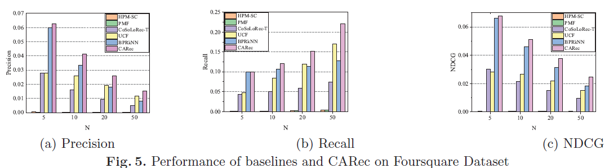
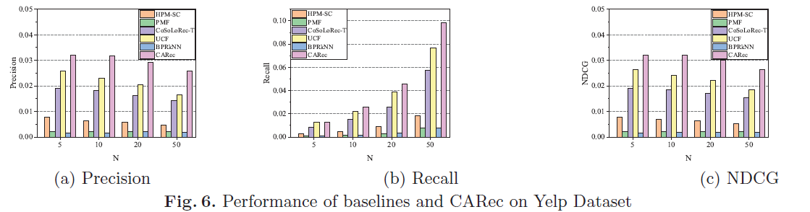

## CARec

CARec: Content-Aware Point-of-Interest Recommendation via Adaptive Bayesian Personalized Ranking (ICONIP 2019)

## Performance

```
Details for Precision:

| Dataset    | Precision@5 | Precision@10 | Precision@20   | Precision@50 |
| ---------- | ------------| -------------| ---------------| -------------|
| Foursquare | 0.0627      | 0.0412       | 0.0261         | 0.0152       |
| Yelp       | 0.032       | 0.032        | 0.0293         | 0.0247       |
```

```
Details for Recall:

| Dataset    | Recall@5    | Recall@10    | Recall@20      | Recall@50    |
| ---------- | ------------| -------------| ---------------| -------------|
| Foursquare | 0.09543     | 0.1205       | 0.1525         | 0.2215       |
| Yelp       | 0.0128      | 0.0259       | 0.0468         | 0.0986      |
```

```
Details for NDCG:

| Dataset    | NDCG@5       | NDCG@10      | NDCG@20        | NDCG@50      |
| ---------- | ------------ | -------------| ---------------| -------------|
| Foursquare | 0.0676       | 0.0513       | 0.3762         | 0.2459       |
| Yelp       | 0.032        | 0.032        | 0.03           | 0.0264       |
```
- The performance of our framework on Foursquare.



- The performance of our framework on Yelp.



## Requirements

- python==3.7
- numpy==1.19.2
- sklearn==1.0
- scipy==1.1.0
- gensim==4.0.1
- nltk==3.3

## Datasets

We use two real-world LBSN datasets from Foursquare and Yep.
```
Statistics:

| Dataset    | Number of users | Number of POIs | Number of check-ins    | Number of reviews       | User-POI matrix density|
| ---------- | --------------- | -------------- | ---------------------- |-------------------------|----------------------- |
| Foursquare | 9,728           | 12,449         | 177,142                | 234,793                 |0.15%                   |
| Yelp       | 5,577           | 6,900          | 518,186                | 542,707                 |0.46%                   |
```

## How to run CARec model

```python
python recommendation.py -dataset Foursquare/Yelp -topK 100 -trainCheckin True -trainSenti True -trainTopic True -trainBPR True
```

## Citation
Please cite our paper if you use the code or datasets:
```
@article{LiuSZGX19,
  title={CARec: Content-Aware Point-of-Interest Recommendation via Adaptive Bayesian Personalized Ranking},
  author={Baoping Liu, Yijun Su,  Daren Zha, Neng Gao, and Ji Xiang},
  journal={Australian Journal of Intelligent Information Processing Systems}
  volume= {15},
  number= {3},
  pages= {61--68},
  year= {2019}
}
```
## Contact

If you have any questions, please contact us by suyijun.ucas@gmail.com, we will be happy to assist.

Last Update Date: October 20, 2021